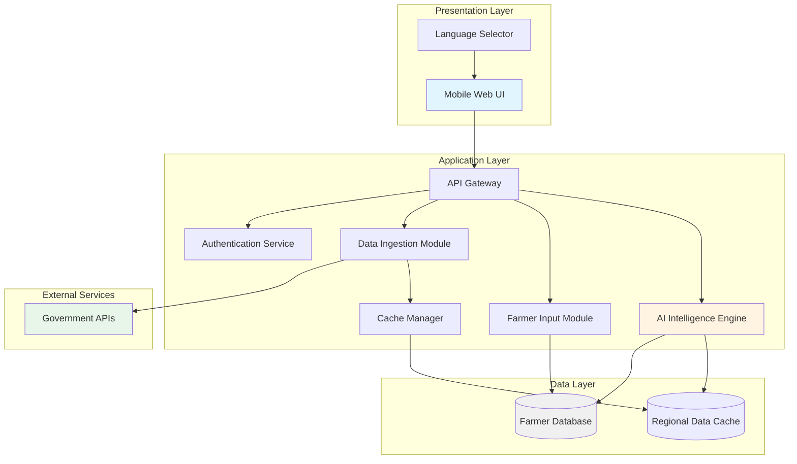
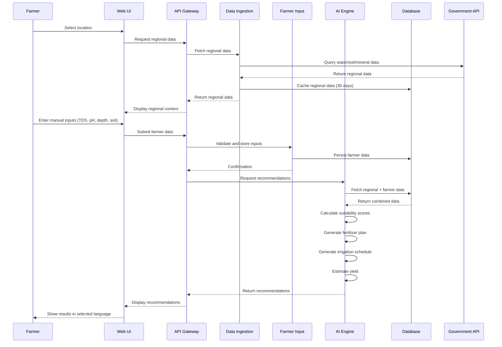

# Design Document: AI-Powered Crop Intelligence Platform

## Overview

The AI-Powered Crop Intelligence Platform is a mobile-responsive web application that combines government agricultural datasets with farmer-provided field measurements to deliver personalized crop recommendations. The system architecture follows a three-tier design: a presentation layer (mobile-responsive web UI), an application layer (data processing and AI analysis), and a data layer (AWS-hosted databases and caches).

The platform addresses the capital constraints of rural Indian farmers by eliminating the need for expensive IoT sensors while still providing data-driven insights. The architecture is designed with future extensibility in mind, allowing seamless integration of IoT devices (ESP32 microcontrollers) to replace manual inputs without requiring major refactoring.

Key design principles:
- Mobile-first responsive design for low-end smartphones
- Bilingual support (English and Hindi) throughout the interface
- Offline-capable data entry with sync-on-connect
- Modular data ingestion supporting multiple input sources
- Scalable AWS infrastructure for compute-intensive AI operations

## Architecture

### System Architecture Diagram



### Component Interaction Flow



## Components and Interfaces

### 1. Data Ingestion Module

**Responsibility:** Fetch and cache regional agricultural data from government APIs.

**Interfaces:**

```typescript
interface RegionalData {
  locationId: string;
  waterTableLevel: number; // meters below ground
  mineralContent: MineralComposition;
  soilDistrictData: SoilDistrictInfo;
  timestamp: Date;
  source: string;
}

interface MineralComposition {
  nitrogen: number; // ppm
  phosphorus: number; // ppm
  potassium: number; // ppm
  organicCarbon: number; // percentage
  sulfur: number; // ppm
  zinc: number; // ppm
  iron: number; // ppm
}

interface SoilDistrictInfo {
  districtName: string;
  soilTexture: string;
  drainageClass: string;
  erosionLevel: string;
}

interface DataIngestionModule {
  fetchRegionalData(locationId: string): Promise<RegionalData>;
  getCachedData(locationId: string): Promise<RegionalData | null>;
  refreshCache(locationId: string): Promise<void>;
  validateDataFormat(data: any): boolean;
}
```

**Implementation Notes:**
- Use AWS Lambda for serverless API calls to government endpoints
- Implement exponential backoff for API failures
- Store cached data in Amazon ElastiCache (Redis) with 30-day TTL
- Validate data schema before caching to prevent corrupt data propagation

### 2. Farmer Input Module

**Responsibility:** Collect, validate, and persist manual field measurements from farmers.

**Interfaces:**

```typescript
interface FarmerInput {
  farmerId: string;
  locationId: string;
  tdsValue: number; // ppm
  phLevel: number; // 0-14 scale
  borewellDepth: number; // meters
  soilType: SoilType;
  timestamp: Date;
}

enum SoilType {
  CLAY = "clay",
  SANDY = "sandy",
  LOAMY = "loamy",
  SILTY = "silty",
  PEATY = "peaty",
  CHALKY = "chalky",
  LATERITE = "laterite"
}

interface ValidationResult {
  isValid: boolean;
  errors: ValidationError[];
}

interface ValidationError {
  field: string;
  message: string;
  messageHindi: string;
}

interface FarmerInputModule {
  validateInput(input: FarmerInput): ValidationResult;
  saveInput(input: FarmerInput): Promise<string>; // returns input ID
  getInputHistory(farmerId: string): Promise<FarmerInput[]>;
  getLatestInput(farmerId: string): Promise<FarmerInput | null>;
}
```

**Validation Rules:**
- TDS Value: 0-5000 ppm (typical range for agricultural water)
- pH Level: 0-14 (strict chemical scale)
- Borewell Depth: 0-500 meters (realistic depth range)
- Soil Type: Must match predefined enum values

**Implementation Notes:**
- Use AWS DynamoDB for farmer input storage (fast writes, scalable)
- Implement client-side validation for immediate feedback
- Store validation error messages in both English and Hindi
- Support offline data entry with local storage and sync on reconnect

### 3. AI Intelligence Engine

**Responsibility:** Analyze combined data to generate crop recommendations, fertilizer plans, irrigation schedules, and yield predictions.

**Interfaces:**

```typescript
interface CropRecommendation {
  cropName: string;
  cropNameHindi: string;
  suitabilityScore: number; // 0-100
  confidence: number; // 0-1
  reasoning: string[];
  reasoningHindi: string[];
}

interface FertilizerPlan {
  cropName: string;
  applications: FertilizerApplication[];
}

interface FertilizerApplication {
  fertilizerType: string;
  fertilizerTypeHindi: string;
  quantityKgPerHectare: number;
  applicationTiming: string; // e.g., "Before sowing", "30 days after sowing"
  applicationTimingHindi: string;
  growthStage: string;
}

interface IrrigationSchedule {
  cropName: string;
  frequencyDays: number;
  volumeLitersPerEvent: number;
  totalSeasonalWaterRequirement: number; // liters per hectare
  conservationRecommendations: string[];
  conservationRecommendationsHindi: string[];
}

interface YieldEstimation {
  cropName: string;
  estimatedYieldKgPerHectare: number;
  confidenceInterval: {
    lower: number;
    upper: number;
  };
  factors: YieldFactor[];
}

interface YieldFactor {
  name: string;
  impact: "positive" | "negative" | "neutral";
  description: string;
  descriptionHindi: string;
}

interface AIEngine {
  analyzeCropSuitability(
    regional: RegionalData,
    manual: FarmerInput
  ): Promise<CropRecommendation[]>;
  
  generateFertilizerPlan(
    crop: string,
    regional: RegionalData,
    manual: FarmerInput
  ): Promise<FertilizerPlan>;
  
  generateIrrigationSchedule(
    crop: string,
    regional: RegionalData,
    manual: FarmerInput
  ): Promise<IrrigationSchedule>;
  
  estimateYield(
    crop: string,
    regional: RegionalData,
    manual: FarmerInput
  ): Promise<YieldEstimation>;
}
```

**AI Model Architecture:**

The AI Engine uses a multi-model approach:

1. **Crop Suitability Model:**
   - Input features: water table level, mineral content (7 parameters), pH, TDS, borewell depth, soil type, soil district data
   - Model type: Gradient Boosting (XGBoost) for tabular data
   - Output: Suitability score (0-100) for each crop in database
   - Training data: Historical crop yield data from Indian agricultural research institutes

2. **Fertilizer Recommendation Model:**
   - Rule-based system with ML refinement
   - Base rules from Indian Council of Agricultural Research (ICAR) guidelines
   - ML component adjusts quantities based on soil mineral deficiencies
   - Considers crop-specific nutrient requirements

3. **Irrigation Scheduling Model:**
   - Combines crop water requirements (FAO guidelines) with local water availability
   - Factors: crop evapotranspiration, water table level, borewell depth, soil water retention
   - Adjusts schedule based on soil type drainage characteristics

4. **Yield Prediction Model:**
   - Ensemble model combining:
     * Regression model trained on historical yield data
     * Suitability score as primary feature
     * Environmental stress factors (water availability, nutrient deficiency)
   - Outputs point estimate with confidence interval

**Implementation Notes:**
- Deploy models on AWS SageMaker for scalable inference
- Use AWS Lambda for lightweight model serving
- Cache model predictions for identical input combinations (1 hour TTL)
- Implement model versioning for A/B testing and rollback capability

### 4. Language Service

**Responsibility:** Provide bilingual support across the platform.

**Interfaces:**

```typescript
interface LanguageService {
  translate(key: string, language: "en" | "hi"): string;
  setUserLanguage(userId: string, language: "en" | "hi"): Promise<void>;
  getUserLanguage(userId: string): Promise<"en" | "hi">;
}

interface TranslationDictionary {
  [key: string]: {
    en: string;
    hi: string;
  };
}
```

**Implementation Notes:**
- Store translations in JSON files for easy updates
- Use i18n library (e.g., i18next) for client-side translation
- Preload all translations on app initialization to avoid latency
- Store user language preference in DynamoDB user profile

### 5. API Gateway

**Responsibility:** Route requests, handle authentication, and enforce rate limiting.

**Endpoints:**

```
POST   /api/v1/auth/register
POST   /api/v1/auth/login
GET    /api/v1/regional-data/:locationId
POST   /api/v1/farmer-input
GET    /api/v1/farmer-input/history
POST   /api/v1/recommendations
GET    /api/v1/recommendations/:cropName/fertilizer
GET    /api/v1/recommendations/:cropName/irrigation
GET    /api/v1/recommendations/:cropName/yield
PUT    /api/v1/user/language
```

**Implementation Notes:**
- Use AWS API Gateway for request routing
- Implement JWT-based authentication
- Rate limiting: 100 requests per minute per user
- CORS configuration for mobile web access

## Data Models

### Database Schema (DynamoDB)

**Users Table:**
```typescript
interface User {
  userId: string; // Partition key
  phoneNumber: string;
  name: string;
  language: "en" | "hi";
  createdAt: Date;
  lastLoginAt: Date;
}
```

**FarmerInputs Table:**
```typescript
interface FarmerInputRecord {
  inputId: string; // Partition key
  farmerId: string; // GSI partition key
  locationId: string;
  tdsValue: number;
  phLevel: number;
  borewellDepth: number;
  soilType: string;
  timestamp: Date; // GSI sort key
  ttl: number; // Auto-delete after 2 years
}
```

**RegionalDataCache (ElastiCache Redis):**
```typescript
// Key: `regional:${locationId}`
// Value: JSON-serialized RegionalData
// TTL: 30 days (2592000 seconds)
```

**RecommendationsCache (ElastiCache Redis):**
```typescript
// Key: `rec:${hash(regionalData + farmerInput)}`
// Value: JSON-serialized recommendations
// TTL: 1 hour (3600 seconds)
```

### Data Flow

1. **User Registration/Login:**
   - User provides phone number
   - OTP verification (AWS SNS)
   - Create user record in DynamoDB
   - Return JWT token

2. **Data Collection:**
   - User selects location → fetch regional data (cache-first)
   - User enters manual inputs → validate → store in DynamoDB
   - Combine regional + manual data

3. **Recommendation Generation:**
   - Check recommendations cache
   - If miss: invoke AI Engine → cache results → return
   - If hit: return cached results

4. **Historical Tracking:**
   - Query FarmerInputs table by farmerId (GSI)
   - Display chronological history
   - Allow comparison between time periods


## Correctness Properties

*A property is a characteristic or behavior that should hold true across all valid executions of a system—essentially, a formal statement about what the system should do. Properties serve as the bridge between human-readable specifications and machine-verifiable correctness guarantees.*

### Data Ingestion Properties

**Property 1: Complete Regional Data Retrieval**
*For any* valid location identifier, when the Data Ingestion Module fetches regional data, the returned data should contain water table level, mineral content, and soil district information.
**Validates: Requirements 1.1, 1.2, 1.3**

**Property 2: API Failure Error Handling**
*For any* Government API failure scenario (timeout, 404, 500, network error), the Data Ingestion Module should return a descriptive error message that identifies the failure type.
**Validates: Requirements 1.4**

**Property 3: Data Format Validation**
*For any* data retrieved from Government APIs, the Data Ingestion Module should validate the data format before storage, and reject data that does not match the expected schema.
**Validates: Requirements 1.5**

**Property 4: Cache Refresh for Stale Data**
*For any* cached regional data older than 30 days, when requested, the Data Ingestion Module should fetch fresh data from the Government API and update the cache.
**Validates: Requirements 1.6**

**Property 5: Cache-First Strategy**
*For any* location identifier with cached regional data less than 30 days old, the Data Ingestion Module should return cached data without making a new API request.
**Validates: Requirements 9.5**

### Farmer Input Properties

**Property 6: Valid Input Acceptance**
*For any* farmer input with TDS value (0-5000 ppm), pH level (0-14), borewell depth (0-500m), and valid soil type, the Farmer Input Module should accept and persist the data.
**Validates: Requirements 2.2, 2.3, 2.4, 2.5, 2.8**

**Property 7: Missing Field Rejection**
*For any* farmer input with one or more required fields empty, the Farmer Input Module should reject the submission and return validation errors identifying the missing fields.
**Validates: Requirements 2.6**

**Property 8: Out-of-Range Rejection**
*For any* farmer input with numeric values outside valid ranges (TDS > 5000, pH < 0 or pH > 14, depth > 500m), the Farmer Input Module should reject the input and return range validation errors.
**Validates: Requirements 2.7**

**Property 9: Input Persistence with Timestamp**
*For any* valid farmer input, when persisted to the database, the stored record should include a timestamp indicating when the data was submitted.
**Validates: Requirements 9.1**

**Property 10: Most Recent Input Retrieval**
*For any* farmer with multiple historical inputs, when retrieving the latest input, the Platform should return the input with the most recent timestamp.
**Validates: Requirements 9.2**

**Property 11: Chronological History Ordering**
*For any* farmer's historical inputs, when displayed, the inputs should be ordered by timestamp in chronological order (oldest to newest or newest to oldest consistently).
**Validates: Requirements 9.3**

### AI Engine - Crop Suitability Properties

**Property 12: Suitability Score Range**
*For any* combination of valid regional data and farmer input, the AI Engine should generate crop suitability scores between 0 and 100 (inclusive).
**Validates: Requirements 3.1**

**Property 13: Input Parameter Influence on Suitability**
*For any* two input combinations that differ in at least one parameter (water table, minerals, pH, TDS, borewell depth, soil type, or soil district), the AI Engine should produce different suitability scores (unless the parameters have no impact on the specific crop).
**Validates: Requirements 3.2, 3.3, 3.4, 3.5, 3.6, 3.7, 3.8**

**Property 14: Crop Ranking by Score**
*For any* list of crop recommendations, the crops should be ordered by suitability score in descending order (highest score first).
**Validates: Requirements 3.9**

### AI Engine - Fertilizer Recommendation Properties

**Property 15: Input Parameter Influence on Fertilizer Plan**
*For any* two input combinations that differ in soil mineral content, pH level, or soil type, the AI Engine should produce different fertilizer plans (unless the differences don't affect fertilizer requirements).
**Validates: Requirements 4.1, 4.2, 4.3**

**Property 16: Complete Fertilizer Plan Format**
*For any* generated fertilizer plan, the plan should specify fertilizer types, application quantities in kg/hectare, and application timing relative to crop growth stages for each application.
**Validates: Requirements 4.4, 4.5, 4.6**

### AI Engine - Irrigation Schedule Properties

**Property 17: Input Parameter Influence on Irrigation Schedule**
*For any* two input combinations that differ in water table level, borewell depth, or crop type, the AI Engine should produce different irrigation schedules (unless the differences don't affect water requirements).
**Validates: Requirements 5.1, 5.2, 5.3**

**Property 18: Complete Irrigation Schedule Format**
*For any* generated irrigation schedule, the schedule should specify irrigation frequency in days and water volume per event in liters.
**Validates: Requirements 5.4, 5.5**

**Property 19: Water Conservation Recommendations**
*For any* input with critically low water table levels (below a defined threshold), the AI Engine should include water conservation recommendations in the irrigation schedule.
**Validates: Requirements 5.6**

### AI Engine - Yield Prediction Properties

**Property 20: Yield Estimation Format**
*For any* generated yield estimation, the estimation should include a value in kilograms per hectare and a confidence interval with lower and upper bounds.
**Validates: Requirements 6.1, 6.5**

**Property 21: Input Parameter Influence on Yield**
*For any* two input combinations that differ in suitability score, regional data parameters, or manual input parameters, the AI Engine should produce different yield estimations (unless the differences don't affect yield).
**Validates: Requirements 6.2, 6.3, 6.4**

### Language Support Properties

**Property 22: Complete Translation Coverage**
*For any* UI text key in the translation dictionary, translations should exist for both English and Hindi languages.
**Validates: Requirements 7.2, 7.3**

**Property 23: Language Preference Persistence**
*For any* user who changes their language preference, when they return in a future session, the Platform should display content in their previously selected language.
**Validates: Requirements 7.4**

**Property 24: Recommendation Translation**
*For any* AI Engine recommendation (crop suitability, fertilizer plan, irrigation schedule, yield estimation), the displayed text should be in the user's selected language.
**Validates: Requirements 7.5**

**Property 25: Error Message Translation**
*For any* validation error or system error, the error message should be displayed in the user's selected language.
**Validates: Requirements 7.6, 10.5**

### Performance Properties

**Property 26: Mobile Load Time**
*For any* page load on a simulated 3G network connection, the Platform should complete initial render within 5 seconds.
**Validates: Requirements 8.3**

### Error Handling Properties

**Property 27: API Failure Error Messages**
*For any* Government API request failure, the Platform should display an error message that explains the issue to the user.
**Validates: Requirements 10.1**

**Property 28: Insufficient Data Error Feedback**
*For any* attempt to generate recommendations with missing required data, the AI Engine should return an error that specifies which data fields are missing.
**Validates: Requirements 10.2**

**Property 29: Offline Data Preservation**
*For any* form submission that fails due to network connectivity loss, the Platform should preserve the entered data locally and allow the user to retry submission when connectivity is restored.
**Validates: Requirements 10.3**

**Property 30: Error Logging**
*For any* error that occurs in the system (API failures, validation errors, processing errors), the Platform should log error details including timestamp, error type, and context for debugging.
**Validates: Requirements 10.4**

### Security Properties

**Property 31: Authentication Enforcement**
*For any* API endpoint that accesses user-specific data, unauthenticated requests should be rejected with a 401 Unauthorized response.
**Validates: Requirements 11.6**

### IoT Integration Properties

**Property 32: Input Source Uniformity**
*For any* identical data provided through manual input or IoT device input, the Platform should process both inputs identically and produce the same recommendations.
**Validates: Requirements 12.2**

**Property 33: IoT Endpoint Data Acceptance**
*For any* properly formatted data from an IoT device (including device ID, timestamp, and sensor readings), the Platform's IoT API endpoint should accept and process the data.
**Validates: Requirements 12.4**

**Property 34: Manual Input Fallback Support**
*For any* system state where IoT endpoints are available, the Platform should continue to accept and process manual farmer inputs as an alternative data source.
**Validates: Requirements 12.5**

## Error Handling

### Error Categories

1. **External API Errors:**
   - Government API unavailable (503 Service Unavailable)
   - Government API timeout (408 Request Timeout)
   - Invalid API response format (422 Unprocessable Entity)
   - Rate limiting exceeded (429 Too Many Requests)

2. **Validation Errors:**
   - Missing required fields (400 Bad Request)
   - Out-of-range numeric values (400 Bad Request)
   - Invalid soil type selection (400 Bad Request)
   - Invalid location identifier (404 Not Found)

3. **Processing Errors:**
   - AI model inference failure (500 Internal Server Error)
   - Insufficient data for recommendations (422 Unprocessable Entity)
   - Database connection failure (503 Service Unavailable)
   - Cache service unavailable (degraded mode, continue with API calls)

4. **Authentication Errors:**
   - Missing or invalid JWT token (401 Unauthorized)
   - Expired token (401 Unauthorized)
   - Insufficient permissions (403 Forbidden)

### Error Response Format

All errors should follow a consistent JSON structure:

```typescript
interface ErrorResponse {
  error: {
    code: string; // Machine-readable error code
    message: string; // Human-readable message in English
    messageHindi: string; // Human-readable message in Hindi
    details?: any; // Additional context (e.g., missing fields)
    timestamp: Date;
    requestId: string; // For support tracking
  };
}
```

### Error Handling Strategies

1. **Retry with Exponential Backoff:**
   - Apply to transient Government API failures
   - Max 3 retries with delays: 1s, 2s, 4s
   - After max retries, return error to user

2. **Graceful Degradation:**
   - If cache service fails, continue with direct API calls
   - If AI model fails, provide basic rule-based recommendations
   - If translation service fails, default to English

3. **User-Friendly Messages:**
   - Avoid technical jargon in error messages
   - Provide actionable guidance (e.g., "Please check your internet connection")
   - Include support contact information for persistent errors

4. **Logging and Monitoring:**
   - Log all errors to AWS CloudWatch
   - Set up alerts for critical errors (API failures > 10%, model errors)
   - Track error rates by category for continuous improvement

## Testing Strategy

### Dual Testing Approach

The platform will employ both unit testing and property-based testing to ensure comprehensive coverage:

- **Unit tests**: Verify specific examples, edge cases, and error conditions
- **Property tests**: Verify universal properties across all inputs

Both testing approaches are complementary and necessary. Unit tests catch concrete bugs in specific scenarios, while property tests verify general correctness across a wide range of inputs.

### Property-Based Testing Configuration

**Library Selection:**
- **TypeScript/JavaScript**: Use `fast-check` library for property-based testing
- **Python** (if used for AI models): Use `hypothesis` library

**Test Configuration:**
- Each property test must run minimum 100 iterations (due to randomization)
- Each property test must reference its design document property
- Tag format: `Feature: ai-crop-intelligence-platform, Property {number}: {property_text}`

**Example Property Test Structure:**

```typescript
import fc from 'fast-check';

// Feature: ai-crop-intelligence-platform, Property 6: Valid Input Acceptance
test('Property 6: Valid inputs should be accepted and persisted', () => {
  fc.assert(
    fc.property(
      fc.record({
        tdsValue: fc.integer({ min: 0, max: 5000 }),
        phLevel: fc.float({ min: 0, max: 14 }),
        borewellDepth: fc.float({ min: 0, max: 500 }),
        soilType: fc.constantFrom('clay', 'sandy', 'loamy', 'silty', 'peaty', 'chalky', 'laterite')
      }),
      async (input) => {
        const result = await farmerInputModule.validateInput(input);
        expect(result.isValid).toBe(true);
        
        const savedId = await farmerInputModule.saveInput(input);
        expect(savedId).toBeDefined();
        
        const retrieved = await farmerInputModule.getInputById(savedId);
        expect(retrieved).toMatchObject(input);
      }
    ),
    { numRuns: 100 }
  );
});
```

### Unit Testing Strategy

**Focus Areas for Unit Tests:**
1. **Specific Examples**: Test known input-output pairs for AI models
2. **Edge Cases**: Test boundary values (pH = 0, pH = 14, TDS = 0, TDS = 5000)
3. **Error Conditions**: Test specific error scenarios (empty fields, invalid tokens)
4. **Integration Points**: Test component interactions (API Gateway → Data Ingestion)

**Unit Test Balance:**
- Avoid writing too many unit tests for scenarios covered by property tests
- Focus unit tests on concrete examples that demonstrate correct behavior
- Use unit tests for integration testing between components

**Example Unit Test:**

```typescript
// Unit test for specific edge case
test('pH level of exactly 0 should be accepted', async () => {
  const input = {
    tdsValue: 500,
    phLevel: 0, // Edge case: minimum pH
    borewellDepth: 50,
    soilType: 'loamy'
  };
  
  const result = await farmerInputModule.validateInput(input);
  expect(result.isValid).toBe(true);
});

// Unit test for specific error condition
test('Empty TDS value should return specific error message', async () => {
  const input = {
    tdsValue: null,
    phLevel: 7,
    borewellDepth: 50,
    soilType: 'loamy'
  };
  
  const result = await farmerInputModule.validateInput(input);
  expect(result.isValid).toBe(false);
  expect(result.errors).toContainEqual({
    field: 'tdsValue',
    message: 'TDS value is required',
    messageHindi: 'TDS मान आवश्यक है'
  });
});
```

### Test Coverage Goals

- **Code Coverage**: Minimum 80% line coverage
- **Property Coverage**: All 34 correctness properties must have corresponding property tests
- **Integration Coverage**: All API endpoints must have integration tests
- **Error Path Coverage**: All error handling paths must be tested

### Testing Infrastructure

- **CI/CD Integration**: Run all tests on every pull request
- **Test Environment**: Use AWS LocalStack for local AWS service mocking
- **Mock Services**: Mock Government APIs with configurable responses
- **Performance Testing**: Use Lighthouse CI for mobile performance validation
- **Accessibility Testing**: Use axe-core for WCAG compliance checking

### Test Data Management

- **Synthetic Data**: Generate realistic Indian location data for testing
- **Anonymized Data**: Use anonymized farmer data (if available) for model validation
- **Edge Case Data**: Maintain a suite of edge case inputs (extreme pH, very deep borewells, etc.)
- **Multilingual Data**: Test with both English and Hindi text throughout
